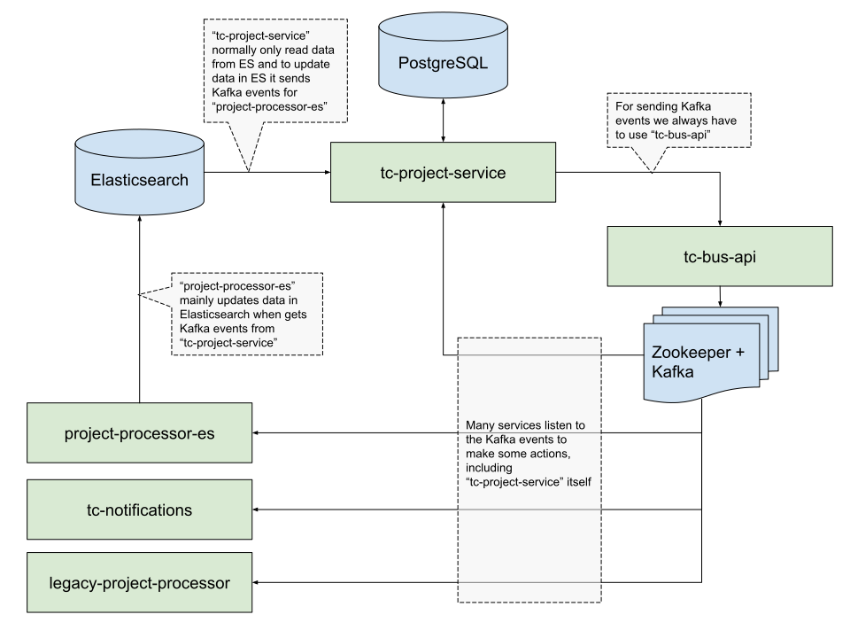

# Topcoder Project Service Architecture

- [Overview](#overview)
- [Elasticsearch indexing](#elasticsearch-indexing)
  - [Read data](#read-data)
  - [Write data](#write-data)
- [Kafka messages structure](#kafka-messages-structure)

## Overview

Topcoder Project Service is a microservice to manage CRUD operations for all things related to Projects. To communicate with other microservices like `tc-notifications`, `project-processor-es`, `legacy-project-processor` and event with itself **Project Service** produces Kafka messages and these service listen to the Kafka messages do some stuff. **Project Service** don't send Kafka messages directly, but uses a special service to send Kafka messages called `tc-bus-api`. So no matter what service we want to update, first we have to setup Kafka with Zookeeper and `tc-bus-api`.



*This diagram shows just some part of relations and services that are most important, it doesn't show all of them.*

## Elasticsearch indexing

It's important to keep in mind how the indexing and reading data from Elasticsearch works.

### Read data

As per global Topcoder API V5 standards, all endpoints in **Project Service** should get data from the Elasticsearch index first. If no data is found, endpoints should try to get data from Database.

### Write data

When some data is updated by **Project Service** it's directly changed in the Database. But **Project Service** doesn't change data in Elasticsearch directly. Instead of that, when some data is changed **Project Service** sends event to the Kafka (using `tc-bus-api`), and `project-processor-es` listens to the Kafka event and index updated data in Elasticsearch for **Project Service**.
As a consequences, data in Elasticsearch is not updated immediately.

## Kafka messages structure

Project Service should send messages to 3 Kafka topics:
- `project.action.create` - when some objects is created
- `project.action.update` - when some objects is updated
- `project.action.delete` - when some objects is deleted

The `payload` of any of this messages should contain the next required properties:
```js
payload: {
  // the name of the resource which has been create, updated or deleted,
  // see constant `RESOURCES` in `src/constants.js` for possible values
  "resource": "...",

  // object which has been created, updated or deleted
  "data": {...},

  // should be present only in `project.action.update` topic, and contain the objects before update
  "previousData": {...},
}
```

Example:
```js
topic: "project.action.update",
payload: {
  "resource": "project.template",
  "data": {
    "id": 1234,
    "name": "Name of project template UPDATED",
    "key": "app",
    "createdAt": 1,
    "createdBy": 1,
    "updatedAt": 2,
    "updatedBy": 2,
  },
  "previousData": {
    "id": 1234,
    "name": "Name of project template",
    "key": "app",
    "createdAt": 1,
    "createdBy": 1,
    "updatedAt": 1,
    "updatedBy": 1,
  },
}
```
