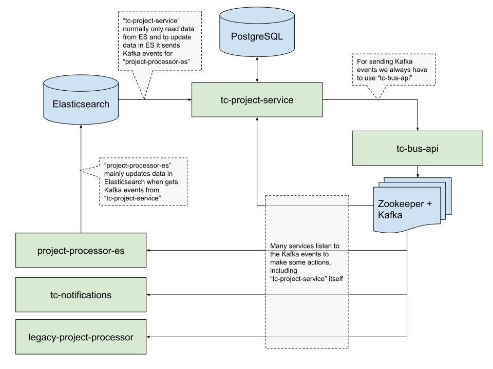

# Topcoder Project Service Architecture

- [Overview](#overview)
- [Data Architecture](#data-architecture)
- [Kafka messages structure](#kafka-messages-structure)

## Overview

Topcoder Project Service is a microservice to manage CRUD operations for all things related to Projects. To communicate with other microservices like `tc-notifications`, `legacy-project-processor`, and even with itself, **Project Service** produces Kafka messages and these services listen to the Kafka messages to perform their work. **Project Service** doesn't send Kafka messages directly, but uses a special service called `tc-bus-api`. So no matter what service we want to update, first we have to setup Kafka with Zookeeper and `tc-bus-api`. Project data is stored and retrieved directly from PostgreSQL.



*This diagram shows just some part of relations and services that are most important, it doesn't show all of them. Review and update the diagram if it still shows Elasticsearch components.*

## Data Architecture

- All project data is stored in PostgreSQL.
- Read operations query PostgreSQL directly using Sequelize ORM models; there is no caching or secondary index for reads.
- Write operations update PostgreSQL directly; Kafka events are emitted for downstream consumers but no additional indexing step is required.
- There is no separate Elasticsearch indexing or syncing service involved.

## Kafka messages structure

Project Service should send messages to 3 Kafka topics:
- `project.action.create` - when some objects is created
- `project.action.update` - when some objects is updated
- `project.action.delete` - when some objects is deleted

The `payload` of any of this messages should contain the next required properties:
```js
payload: {
  // the name of the resource which has been create, updated or deleted,
  // see constant `RESOURCES` in `src/constants.js` for possible values
  "resource": "...",

  // object which has been created, updated or deleted
  "data": {...},

  // should be present only in `project.action.update` topic, and contain the objects before update
  "previousData": {...},
}
```

Example:
```js
topic: "project.action.update",
payload: {
  "resource": "project.template",
  "data": {
    "id": 1234,
    "name": "Name of project template UPDATED",
    "key": "app",
    "createdAt": 1,
    "createdBy": 1,
    "updatedAt": 2,
    "updatedBy": 2,
  },
  "previousData": {
    "id": 1234,
    "name": "Name of project template",
    "key": "app",
    "createdAt": 1,
    "createdBy": 1,
    "updatedAt": 1,
    "updatedBy": 1,
  },
}
```
