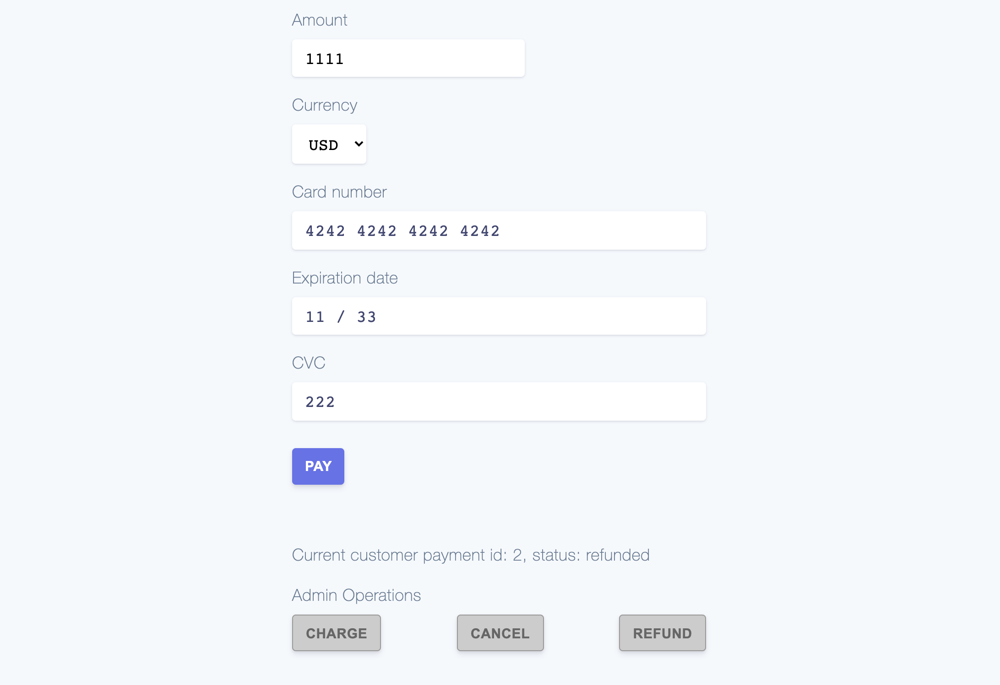

# Customer Payments

Customer Payments API is included in the Projects API and uses Stripe under the hood.

## General Idea

Customer Payments API allows customers to create payment holds and we can associate them with any entity like `project`, `challenge`, `phase` and so on. For example, to associated payment with a `project` we could set `reference=project` and `referenceId=12345` (project id) during creating of the payment or after creating using `PATCH /customer-payments/{id}` endpoint.

Then in any Topcoder's API we could retrieve payments associated with any entity using endpoint `GET /customer-payments?reference=project&referenceId=12345`.

See [references](#references) to learn more details about the implementation.

## Quick Demo

The easier way to check it out is to run React Demo App which demonstrate how to use Customer Payments API:



To run the React Demo App:

1. Run Project Service API
2. Copy folder [](react-stripe-js) OUTSIDE of `tc-project-service` folder, and then run inside `react-stripe-js`:

   ```sh
   # install dependencies
   npm i

   # run React Demo App
   npm start
   ```

3. Then you can test payments as shown in the [demo video](./assets/react-demo-video.mp4).

## Test Data

Several test cards are available for you to use in test mode to make sure this integration is ready. Use them with any CVC and an expiration date in the future.

NUMBER | DESCRIPTION
--|--
4242424242424242 | Succeeds and immediately processes the payment.
4000002500003155 | Requires authentication. Stripe triggers a modal asking for the customer to authenticate.
4000000000009995 | Always fails with a decline code of insufficient_funds.

For the full list of test cards see the Stripe's guide on [testing](https://stripe.com/docs/testing).

## References

- [Challenge Specification](https://www.topcoder.com/challenges/25fa2d11-9f69-4d81-9f67-fb2eb15cec6a?tab=details) which was used to implement Customer Payments functionality.
- [Place a hold on a card](https://stripe.com/docs/payments/capture-later) Stripe's official guide.
- [Finalize payments on the server](https://stripe.com/docs/payments/accept-a-payment-synchronously) Stripe's official guide.