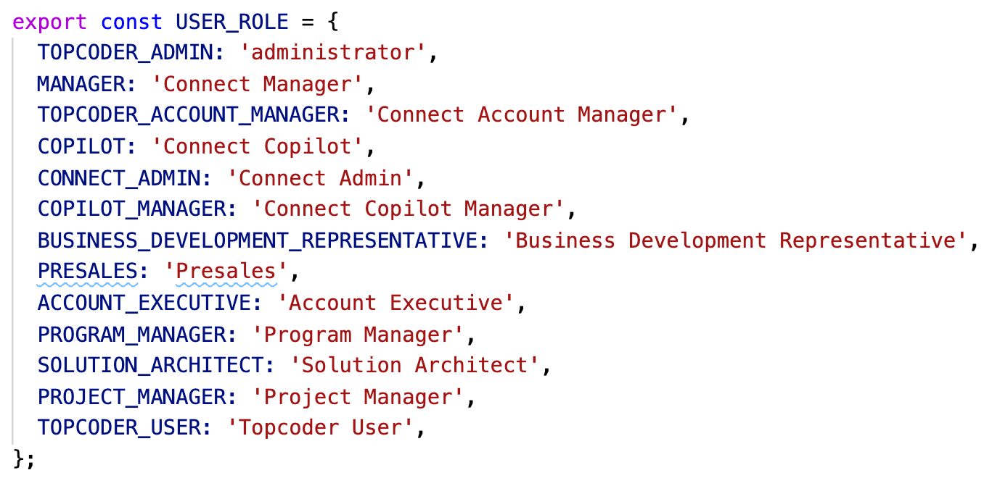
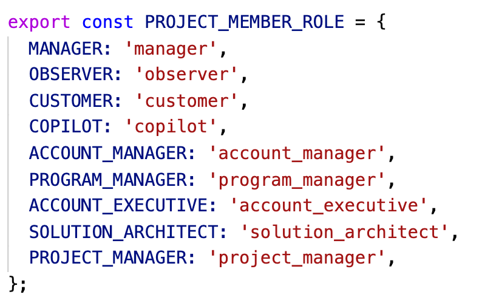

# Permissions Guide

What kind of permissions we have, how they work and how to use them.

- [Overview](#overview)
  - [Topcoder Roles](#topcoder-roles)
  - [Project Role](#project-role)
- [How to Use](#how-to-use)
- [References](#references)

## Overview

Every user may have 2 kind of roles: **Topcoder Roles** and **Project Role**.

### Topcoder Roles

These roles are assigned to user accounts. User may have several **Topcoder Roles**. See [the list of all Topcoder Roles](https://github.com/topcoder-platform/tc-project-service/blob/develop/src/constants.js#L55-L69) which we use in Topcoder Project Service.



By default every user has one role `Topcoder User`, generally this means that such a user is either **customer** or **community member** (freelancer).

### Project Role

When user joins some project and become a member of the project, such a user has one **Project Role** inside that project. One user may have different **Project Role** in different projects. See [the list of all Project Roles](https://github.com/topcoder-platform/tc-project-service/blob/develop/src/constants.js#L23-L33) which we use in Topcoder Project Service.



## How to Use

Let's say you would like to add a new place in code where you want to check user roles/permissions. Please, follow the next guide:

1. Check if we already have defined permission for your case in the [permissions list](https://htmlpreview.github.io/?https://github.com/topcoder-platform/tc-project-service/blob/develop/docs/permissions.html).

2. If you cannot find the permission you need, add new permission to the file https://github.com/topcoder-platform/tc-project-service/blob/develop/src/permissions/constants.js.

   - Follow the guides on how to add a new permission in the header of this file.

3. There are 2 places where you would usually check permissions:
   1. Check if user can call some endpoint (https://github.com/topcoder-platform/tc-project-service/blob/develop/src/permissions/index.js):

      ```js
      Authorizer.setPolicy('projectMember.view', generalPermission(PERMISSION.READ_PROJECT_MEMBER));
      ```

      or

      ```js
      Authorizer.setPolicy('projectMember.edit', generalPermission([
         PERMISSION.UPDATE_PROJECT_MEMBER_CUSTOMER,
         PERMISSION.UPDATE_PROJECT_MEMBER_NON_CUSTOMER,
      ]));
      ```

   2. Inside some endpoint code:

      ```js
      import util from '../util';
      import { PERMISSION } from '../permissions/constants';

      (req, res, next) => {
         ...
         if (hasPermissionByReq(permission, req)) {
            ...
         }
         ...
      }
      ```

4. After you've added all the new permissions you wanted, regenerate [permissions list](https://htmlpreview.github.io/?https://github.com/topcoder-platform/tc-project-service/blob/develop/docs/permissions.html) by running `npm run generate:doc:permissions`. Or run `npm run generate:doc:permissions:dev` which would automatically regenerate HTML file on every change - very useful during development.

## References

- [Permissions list](https://htmlpreview.github.io/?https://github.com/topcoder-platform/tc-project-service/blob/develop/docs/permissions.html)

- [Permissions list source](https://github.com/topcoder-platform/tc-project-service/blob/develop/src/permissions/constants.js)
